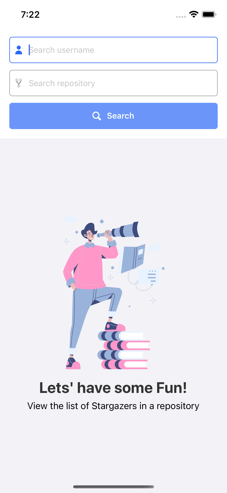
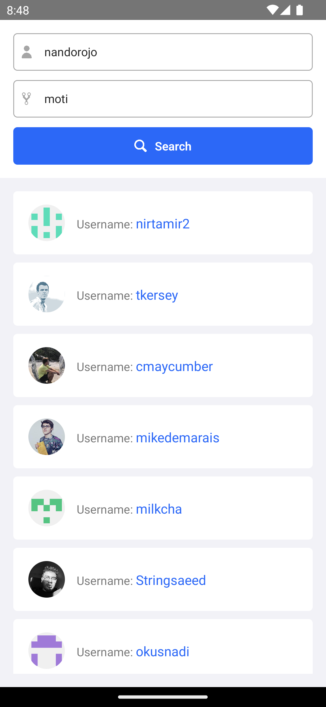

# Carmine Fabbri Stargazer List

This project contains the source code for a simple mobile app that uses the React Native framework.
The application allows (through the use of the GitHub API) the user to type the owner and name of the repository and shows a list of the users who have added it to their favorites.

[](./screenshots/home.png)

[](./screenshots/search.png)

## Installation

You can start by cloning this repository.
After that, you should proceed by running these commands:

```bash
yarn install && yarn pod
```

After you install _node_modules_ and all the _pods_, you can proceed by running and testing the application on your simulator or physical device.

### iOS

To run the application on your iOS device, use this command:

```bash
yarn ios
```

### Android

To run the application on your Android device, use this command:

```bash
yarn android
```

Please note that to avoid any issues when running it on your Android simulator, you should:

-   Go to the `android/` directory of the project
-   Create a file called `local.properties` with this line:
    -   `sdk.dir = /Users/USERNAME/Library/Android/sdk`

---

# Project structure

This project follows a very simple structure:

-   `__tests__`: Folder to store all test files of the application

-   `src`: This folder is the main container of all the application

    -   `assets`: Asset folder to store all images, vectors, etc
    -   `atoms`: : Folder to store any reusable component (such as a generic button)
    -   `components`: This folder contains bigger components that are made from smaller ones, like the component from the folder _/atoms_
    -   `constants`: Folder to store any kind of constant that is used inside the project
    -   `manager`: This folder contains all the managers that are used to interact with a specific API
    -   `models`: Model folder to store all the TypeScripts data types
    -   `screens`: This folder contain each screen of the application
    -   `store`: This folder contains the store and all the slices folder
    -   `services`: Folder containing services that interact with external APIs; specifically, the Octokit authentication token is managed here
    -   `slices`: Folder used to store slices that are needed to manage the store

-   `/index.js`: This is the default entry point of the application.

Note that each component present inside folders like: `atoms`, `components` and `screens`, has its own folder in a way to separate the style and the logic of it.
This makes the components code much cleaner and it also allows (eventually) writing two different style files for Android and iOS if required.

# GitHub Authentication token

For the use of specific GitHub APIs, as we can determine from the documentation, an authentication token must be used.

As far as using the "Stargazers API" is concerned, no token is required.
Nonetheless, I have set up an .env (added inside the .gitignore file and located within the project root) that contains personal authentication tokens.
So, in order to go and use your own token, it is necessary:

-   Create an `.env` file in the project's root directory
-   Insert your own personal GitHub access token inside the `.env` like

```javascript
GIT_HUB_ACCESS_TOKEN = foefhniw13malafoe;
```

After performing the above steps, using `octokit` you will already possess the authentication token needed to make the authorized calls.

# Redux and state managment

The flow of data within the application was managed through the use of the `React Redux` library and `Redux Toolkit`.
This provided greater efficiency and simplicity in data management while avoiding the phenomenon of _props drilling_ and allowing the application to scale more easily
